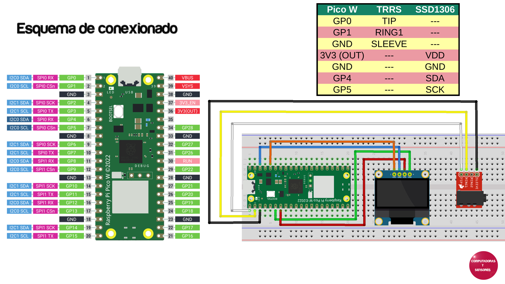

# Altavoces Bluetooth con Raspberry Pi Pico W 

Códigos para Arduino IDE que permite mediante una Raspberry Pi Pico W convertir altavoces comunes en Bluetooth, se agregó una pantalla OLED SSD1306 que permite tener lectura de la canción que se esta escuchando.

# Paso a paso

La explicación completa la podrás ver en el siguiente video de Youtube:
https://youtu.be/8gpokeZEmQ4
